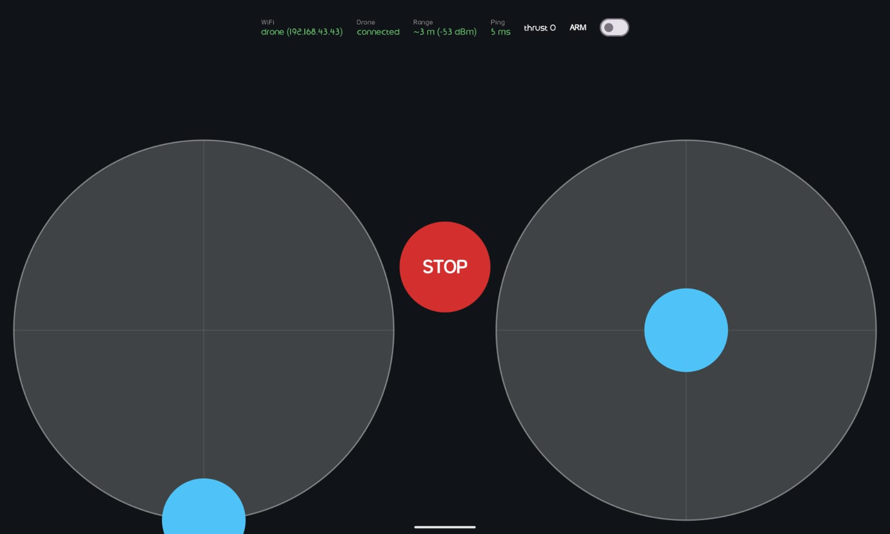

# Zora Drone Controller

Remote control Android untuk drone [ESP-Drone](https://github.com/espressif/esp-drone) lewat WiFi.
Dibuat karena app resmi ESP-Drone tidak bisa mengirim perintah di Android 10 ke atas.



## Fitur

- **Tersambung ke WiFi drone walau tanpa internet.** Android 10+ tidak mau memakai WiFi tanpa internet secara default. App ini mengikat koneksinya langsung ke WiFi drone.
- **Dua joystick mode 2** (layout RC standar):
  - Kiri: naik-turun = thrust (gas), kiri-kanan = yaw (putar).
  - Kanan: naik-turun = pitch (maju-mundur), kiri-kanan = roll (geser kiri-kanan).
  - Stik gas tetap di posisi terakhir saat dilepas, seperti stik RC. Stik lain kembali ke tengah.
  - Deadzone 5% di tengah dan expo supaya gerakan kecil lebih halus.
- **Kirim perintah 50 kali per detik.**
- **Status di bagian atas layar:**
  - **WiFi**: IP tablet. Hijau `drone (192.168.43.x)` kalau sudah di WiFi drone.
  - **Drone**: `connected` kalau drone membalas dalam 1 detik terakhir.
  - **Range**: perkiraan jarak tablet ke drone dari kekuatan sinyal WiFi (dBm).
  - **Ping**: waktu pulang-pergi paket ke drone (ms).
  - **Tilt**: kemiringan roll/pitch drone (derajat). Hijau kalau keduanya di bawah 2°.
  - **Batt**: tegangan baterai drone. Oranye di bawah 3,5 V.
  - **thrust**: nilai gas yang sedang dikirim (0–60000).
- **Fitur keselamatan:**
  - Switch **ARM**: motor tidak akan nyala sebelum ARM dinyalakan.
  - Setelah ARM atau STOP, gas terkunci di 0 sampai stik kiri diturunkan ke paling bawah.
  - Tombol **STOP** besar di tengah: langsung matikan motor.
  - Saat app ditutup, pindah ke app lain, atau layar dikunci: motor dimatikan otomatis.
  - Layar tidak mati sendiri selama app terbuka.
- **SET LEVEL 0°**: kalibrasi level dari app, disimpan permanen di drone (lihat [Kalibrasi level](#kalibrasi-level)).
- **Mode Test Motor** untuk bench test tanpa propeller (lihat [Test motor](#test-motor)).

## Instalasi

1. Download file APK terbaru dari halaman [Releases](https://github.com/h-yusuf/drone-remote-controller/releases).
2. Buka file APK di HP/tablet Android (minimal Android 10).
3. Kalau diminta, izinkan "Install unknown apps" untuk app yang dipakai membuka file.

Kalau sebelumnya sudah memasang versi yang ditandatangani dengan key lain (misalnya build debug), uninstall dulu versi lama.

## Cara pakai

1. Nyalakan drone. Tunggu WiFi `ESP-DRONE_xxxxxxxxxxxx` muncul.
2. Di Android, sambungkan ke WiFi itu dengan password `12345678`.
   Kalau muncul peringatan "tidak ada internet", pilih tetap tersambung.
3. Buka app **Zora Drone**. Dalam 1 detik:
   - WiFi berubah jadi hijau `drone (192.168.43.x)`.
   - Drone berubah jadi `connected`.
   - LED biru di drone berubah dari kedip lambat menjadi nyala terus.
4. Turunkan stik kiri ke paling bawah.
5. Nyalakan switch **ARM**.
6. Naikkan stik kiri pelan-pelan untuk menambah gas. Pakai stik kanan untuk maju-mundur dan geser kiri-kanan.
7. Untuk berhenti: tekan **STOP**, atau turunkan gas lalu matikan ARM.

> **Selalu tes pertama kali tanpa propeller.** Pastikan motor berputar sesuai stik dan berhenti saat STOP ditekan atau layar dikunci.

Kalau drone terbalik, firmware mematikan motor sampai drone di-restart (LED kedip sangat cepat).

### Kalibrasi level

Kalau Tilt tidak mendekati 0° padahal drone di lantai datar, sensor drone perlu dikalibrasi.
Tanpa kalibrasi, drone mengira dirinya miring, sehingga sebagian motor berputar jauh lebih kencang dari yang lain.

1. Taruh drone di permukaan datar dengan posisi seperti saat terbang (baterai terpasang, kaki rata).
2. Pastikan ARM mati dan Drone `connected`, lalu tekan **SET LEVEL 0°**.
3. Jangan sentuh drone, lalu tekan **SET LEVEL** di dialog.
4. Dalam sekitar 1 detik, Tilt harus menunjukkan ≈ 0°/0°. Kalau belum, ulangi.

Kalibrasi tetap tersimpan setelah drone dimatikan. **Hapus kalibrasi** di dialog yang sama mengembalikan offset ke 0°.
Kalibrasi menganggap posisi saat itu rata. Kalau drone duduk miring saat dikalibrasi, drone akan terbang condong.

### Test motor

Untuk mengecek kabel tiap motor dan kekuatan baterai, tanpa flash firmware tes. **Lepas semua propeller dulu.**

1. Pastikan ARM mati, lalu tekan **TEST MOTOR** di bagian atas layar.
2. Cek status **Firmware** jadi `OK`. Kalau muncul `param tidak ada`, firmware drone belum mendukung fitur ini.
3. Atur kekuatan dengan slider (0–100%, default 20%).
4. Tahan tombol **M1–M4** untuk memutar satu motor. Motor berhenti saat jari dilepas.
   Tombol disusun sesuai posisi motor dilihat dari atas, depan di atas.
5. Tahan **SEMUA** untuk memutar keempat motor sekaligus.
6. **RAMP** menaikkan keempat motor dari 10% sampai 100%, naik 5% tiap 2 detik, lalu berhenti sendiri. Tap lagi untuk berhenti.
7. **STOP** mematikan semua motor. **KELUAR** (atau tombol back) kembali ke layar terbang.

Motor juga mati saat app ditutup atau layar dikunci. Kalau WiFi putus, firmware mematikan motor sendiri setelah 1 detik.
Fitur ini butuh firmware dengan pengaman "link lost" di `power_distribution_stock.c`.

### Kalau tidak tersambung

| Gejala | Penyebab | Solusi |
|---|---|---|
| WiFi `searching…` | Belum tersambung ke WiFi mana pun | Sambungkan ke WiFi drone |
| WiFi oranye `NOT drone WiFi` | Tersambung ke WiFi lain | Pindah ke WiFi `ESP-DRONE_...` |
| WiFi hijau, Drone `no reply` | Drone tidak membalas | Restart drone, buka ulang app |

## Kalibrasi

Pengaturan ada sebagai konstanta di kode, belum ada layar setting.

| Konstanta | File | Default | Kegunaan |
|---|---|---|---|
| `MAX_THRUST_APP` | `control/ControlState.kt` | 60000 | Batas gas maksimum. Turunkan untuk membatasi tenaga. |
| `MAX_ANGLE` | `control/ControlState.kt` | 15° | Kemiringan maksimum roll/pitch. |
| `MAX_YAW` | `control/ControlState.kt` | 150°/s | Kecepatan putar maksimum. |
| `PITCH_SIGN` | `control/ControlState.kt` | -1 | Stik kanan maju harus menaikkan M2 & M3 (belakang). Kalau terbalik, ganti tanda. |
| `ROLL_SIGN` | `control/ControlState.kt` | 1 | Stik kanan ke kanan harus menaikkan M3 & M4 (kiri). Kalau terbalik, ganti tanda. |
| `YAW_SIGN` | `control/ControlState.kt` | 1 | Stik kiri ke kanan harus menaikkan M1 & M3 (motor CCW). Kalau terbalik, ganti tanda. |
| `RSSI_AT_1M` | `net/DroneLink.kt` | -40 dBm | Isi dengan nilai dBm saat drone berjarak 1 m dari tablet. |
| `PATH_LOSS_N` | `net/DroneLink.kt` | 2.5 | 2 untuk lapangan terbuka, sampai 3.5 untuk dalam ruangan. |

Arah stik **wajib dicek di bench sebelum terbang** (tanpa propeller, ARM, thrust ±30%, dorong satu stik penuh, lihat PWM di log firmware). Detail di [blueprint.md §13](blueprint.md#13-review-mode-terbang-2026-10-06).

Range adalah perkiraan dari sinyal WiFi, bisa meleset sekitar ±50%. Pakai sebagai patokan kasar, bukan ukuran pasti.

## Build dari source

Butuh JDK 17 dan Android SDK (platform 35).

```bash
./gradlew test assembleDebug
# APK: app/build/outputs/apk/debug/app-debug.apk
adb install -r app/build/outputs/apk/debug/app-debug.apk
```

### Rilis

Push tag versi, lalu GitHub Actions akan membuat Release beserta APK yang sudah ditandatangani:

```bash
git tag v0.2
git push origin v0.2
```

Key rilis disimpan sebagai secret repo `KEYSTORE_BASE64` dan `KEYSTORE_PASSWORD`.

## Teknologi

Kotlin, Jetpack Compose (Material 3), Kotlin Coroutines. Tanpa library pihak ketiga.
Minimal Android 10 (API 29).

Komunikasi: UDP ke `192.168.43.42:2390`, paket CRTP commander (roll, pitch, yaw, thrust) + 1 byte checksum.

```
app/src/main/java/com/zora/drone/
├─ MainActivity.kt          host Compose, layar selalu nyala, matikan motor saat app ditutup
├─ proto/Crtp.kt            encode setpoint, echo, set param by name; parse telemetri
├─ control/ControlState.kt  state joystick, ARM/STOP, mapping stik ke setpoint
├─ control/MotorTest.kt     state mode test motor (tombol, slider, ramp)
├─ net/DroneLink.kt         ikat socket ke WiFi drone, kirim 50 Hz, hitung ping dan range
└─ ui/
   ├─ FlyScreen.kt          layar utama
   ├─ MotorTestScreen.kt    layar test motor
   └─ Joystick.kt           komponen joystick
```

Detail protokol, aturan firmware, dan rencana pengembangan ada di [blueprint.md](blueprint.md).

## Belum ada

- Layar setting (trim, sensitivitas, expo).
- Altitude hold (butuh sensor ketinggian).
- Sambung otomatis ke WiFi drone dari dalam app.
